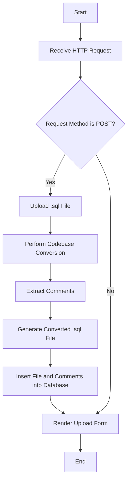
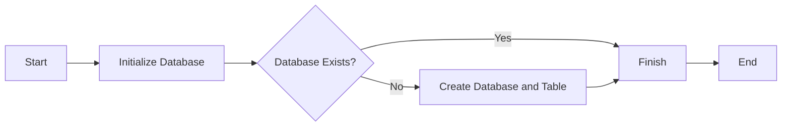

# SQL Code Conversion 

The SQL Code Conversion project is a web application built with Python and Flask that facilitates the conversion of SQL code while preserving comments in it's original form. The primary objective of this project is to allow users to upload SQL files, have the codebase converted according to specific rules, and then obtain the converted SQL file with the original comments reattached.

## Project Components
### app.py
app.py is the main Python file that contains the Flask application, routing, and logic for SQL code conversion and comment extraction.

Dependencies: 
- Flask handles the web application functionality
- sqlparse is used for parsing SQL code and extracting comments

### database.py

database.py contains functions related to the SQLite database used to store information about the uploaded SQL files.

### upload.html

upload.html is the HTML template used to display the web page for uploading SQL files.

Basic Framework for code conversion with comment extraction

‘Converted’ file added in the code path after successful uploading

